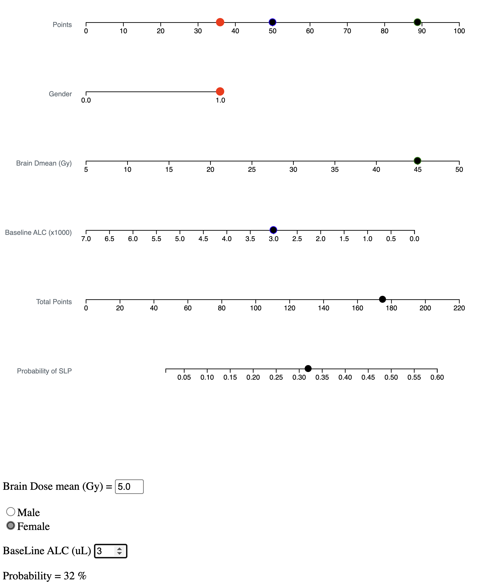

# Nomogram to predict probability of Severe Radiation Induced Lymphopenia

This is a javascript application to predict radiation-induced lymphopenia developed based on the manuscript: 

Nomogram for radiation-induced lymphopenia in patients receiving intensity-modulated radiotherapy based chemoradiation therapy for newly diagnosed glioblastoma

By Nalee Kim et al

(in preparation)

Open 'index.html' from your web-browser, you will see following image.

or upload index.html and lymphopenia.js to your web-site.
