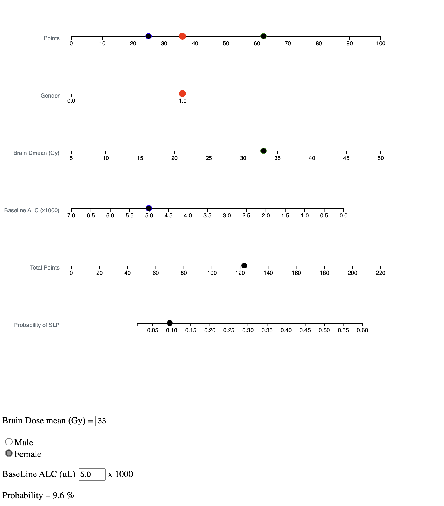

# Nomogram to predict probability of Severe Radiation Induced Lymphopenia

This is a javascript application to predict radiation-induced lymphopenia developed based on the manuscript: 

Kim N, Lee J, Shin H, Shin J, Nam DH, Lee JI, Seol HJ, Kong DS, Choi JW, Chong K, Lee WJ, Chang JH, Kang SG, Moon JH, Cho J, Lim DH, Yoon HI. 
Nomogram for radiation-induced lymphopenia in patients receiving intensity-modulated radiotherapy based-chemoradiation therapy for newly diagnosed glioblastoma: A multi-institutional study. 
Clin Transl Radiat Oncol. 2024 May 22;47:100799. doi: 10.1016/j.ctro.2024.100799.
PMID: 38884005; PMCID: PMC11176633.

Open 'index.html' from your web-browser, you will see following image.

or upload index.html and lymphopenia.js to your web-site.
